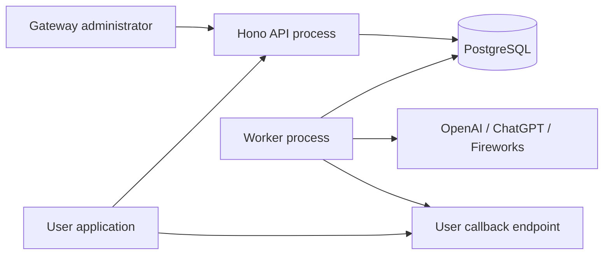
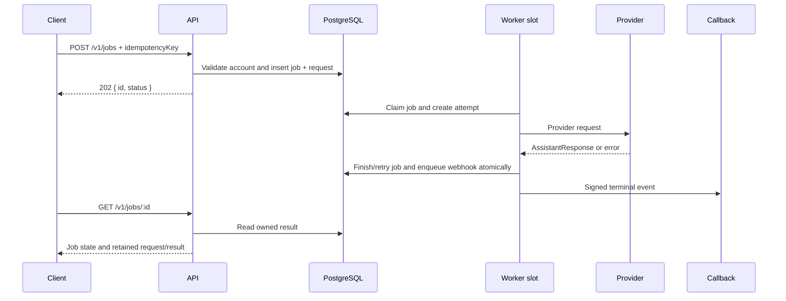

# Architecture

## Purpose

The gateway provides a durable asynchronous boundary between applications and
the provider-specific LLM clients in this monorepo. A user can register multiple
provider accounts, submit jobs using one account, continue a retained job, query
results and usage, and receive signed terminal webhooks.

The design favors explicit PostgreSQL state and small processes. It does not
require a separate queue, cache, scheduler, or workflow engine.

## System context

PostgreSQL is the authoritative store and queue. The API and worker are separate
processes so accepting HTTP traffic is independent of slow provider calls.

## Components

### API process

`src/index.ts` starts the Hono application from `src/app.ts`. Route modules own
HTTP authentication, parsing, and response status. Service modules own scoped
queries and transactions.

The API process:

- authenticates administrators and users;
- manages users, keys, provider accounts, and catalogs;
- validates and durably accepts jobs;
- exposes results, delivery history, and usage reports;
- never performs an LLM request inside the submission handler.

### Worker process

`src/worker.ts` starts three independent activities:

- `WORKER_CONCURRENCY` LLM execution slots;
- one webhook delivery loop;
- one expired-request cleanup loop.

Execution slots share a PostgreSQL pool but hold no database transaction while
waiting for provider I/O. Each slot claims one job, makes one provider call,
then records its attempt and transition in a new transaction.

### Provider packages

`@llm-providers/provider-openai`, `provider-chatgpt`, and `provider-fireworks`
own wire-protocol details. The gateway chooses a package from the stored account
provider, decrypts current credentials, supplies the stored request, and receives
a shared `AssistantResponse`.

Provider-native assistant content remains opaque in contracts and storage. This
allows a later request to replay output in the same provider's expected format.

### PostgreSQL

PostgreSQL stores identity, accounts, jobs, retained requests, attempts,
webhook outbox entries, and delivery attempts. Queue consumers use short
transactions with `FOR UPDATE SKIP LOCKED`. Unique constraints and lease tokens
provide coordination across worker processes.

See [Database design](./database.md) for the complete schema and invariants.

## Job lifecycle

Job states are `queued`, `running`, `retry_wait`, `succeeded`, `failed`, and
`cancelled`. A successful, failed, or cancelled job is terminal.

### Submission and idempotency

The API normalizes and fingerprints the complete submission. A transaction-level
advisory lock serializes one user's use of an idempotency key. Repeating the same
submission returns the original job; reusing the key with different input returns
a conflict.

Idempotency covers durable acceptance. If a worker loses contact after sending a
provider request, the provider outcome can be unknown and a recovery attempt can
send again.

### Continuations

A continuation supplies `previousJobId`, a new idempotency key, and an array of
new messages. The parent must belong to the user, have succeeded, and still have
retained request input.

The child inherits the parent's account, model, instructions, tools, and provider
options. Its stored messages are:

1. the parent's complete stored message list;
2. the parent's native assistant message;
3. the child's new messages.

The child stores a complete independent snapshot. Later execution never walks a
lineage chain, but repeated large contexts consume proportional storage.

## Concurrency and coordination

`WORKER_CONCURRENCY` controls simultaneous LLM calls in one worker process. The
default is one and the accepted range is 1–128. Multiple worker processes may be
run; their configured slots add together.

Each claimed job receives a random lease token and a 60-second expiry. A heartbeat
renews the lease every ten seconds. Finalization requires the current token and a
live lease, preventing an old worker from overwriting a recovered attempt.

Local timers abort provider I/O at lease expiry and at the job's 30-minute
deadline even if a database heartbeat stalls. Shutdown aborts all active calls;
their ambiguous claims recover after expiry instead of being labeled as user
cancellations.

The PostgreSQL pool currently permits ten connections per process. Large worker
concurrency therefore increases simultaneous provider I/O without requiring one
database connection per call. Claims and completion writes queue briefly at the
pool as needed.

## Failure and delivery semantics

Retry eligibility is based on shared `LlmError` categories. Network errors,
timeouts, and selected transient HTTP statuses may retry within three attempts
and the overall job deadline. Invalid input/configuration/response and permanent
provider failures do not retry.

Terminal completion, request-expiry assignment, and webhook outbox insertion are
one transaction. This prevents a committed terminal result without its callback
event. Webhook delivery is at least once: receivers must verify the signature and
deduplicate by stable event ID before processing.

Callback failure never repeats the LLM job. Manual redelivery starts a new
delivery retry cycle for the same immutable event.

## Trust boundaries

- Admin authentication uses a deployment-level bearer key.
- User API keys contain random bytes and are stored only as SHA-256 hashes.
- Provider and webhook secrets use AES-256-GCM with owner/purpose binding.
- Provider base URLs must match built-in origins or the operator's provider
  allowlist. These destinations receive provider credentials.
- Webhook destinations must match a separate HTTPS-only operator allowlist.
- Provider redirects are rejected. The gateway does not fetch message image URLs.
- Database errors and provider-controlled error text are not returned or persisted
  as public job errors.

Network allowlists are application boundaries, not replacements for HTTPS,
firewall/egress policy, rate limiting, or database isolation.

## Deliberate non-goals

The current design does not provide:

- exactly-once provider execution or callback delivery;
- automatic provider-account failover;
- per-user scheduling fairness, quotas, or rate limits;
- streaming model output to gateway clients;
- automatic tool execution;
- distributed tracing or a worker-health endpoint;
- automatic deletion of responses, attempts, or idempotency records.

These can be added when operational measurements justify the added complexity.

